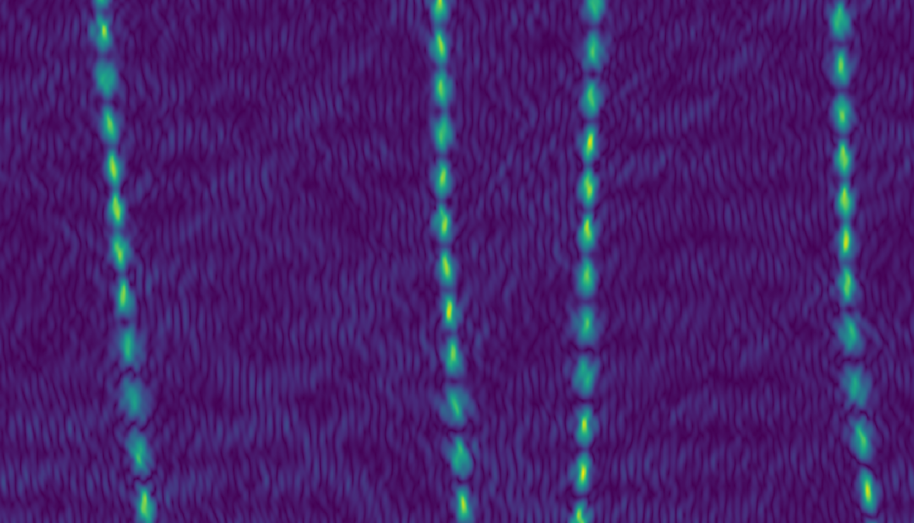
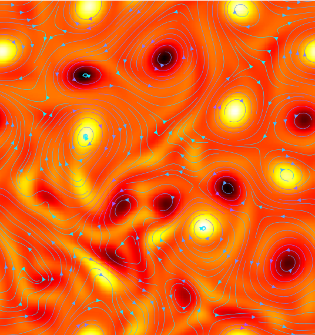
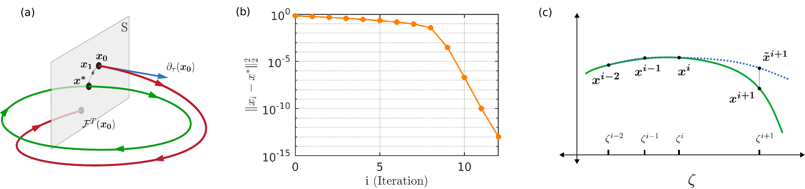
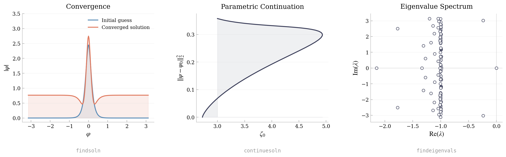

# Channelflow-Dedalus

<p align="center">
  &nbsp;&nbsp;&nbsp;&nbsp;&nbsp;&nbsp;&nbsp;&nbsp;&nbsp;
  
</p>

This project enables computation of exact solutions to generic **PDE (Partial Differential Equation) systems** using string-based equation parsing from the [Dedalus](https://github.com/DedalusProject/dedalus) software (written in Python), coupled to the nsolver library in [channelflow](https://github.com/epfl-ecps/channelflow) for dynamical systems analysis (written in C++). It provides Newton-Krylov methods for computing stationary and periodic orbit solutions, numerical continuation for tracing solution branches through parameter space, and Arnoldi-based eigenvalue analysis for determining their linear stability.

For details on the method and results, see:

> S. Deshmukh, A. Tusnin, A. Tikan, T. J. Kippenberg, T. M. Schneider, *Nonlinear periodic orbit solutions and their bifurcation structure at the origin of soliton hopping in coupled microresonators*, 2025. [arXiv:2508.09921](https://arxiv.org/abs/2508.09921)

<p align="center">
  
</p>
<p align="center"><em>Schematic of the numerical algorithms for computation and parametric continuation of periodic orbit solutions. (a) Newton's algorithm for computing fixed points of the return map corresponding to periodic orbits, (b) typical convergence behavior quantified by the L2-distance from the exact solution at each iteration, (c) computation of a solution branch along a parameter using natural parametric continuation with quadratic extrapolation. Figure from <a href="https://arxiv.org/abs/2509.10283">Gelash et al. (2025)</a>.</em></p>

### Example: Lugiato-Lefever equation

As a demonstration, the repository includes an implementation of the Lugiato-Lefever equation (LLE), a driven-dissipative modification of the **Nonlinear Schrödinger equation** (NLSE) modeling Kerr frequency comb generation in optical microresonators:

$$\frac{\partial \psi}{\partial t} = -(1 + i\zeta_0)\psi + id_2 \frac{\partial^2 \psi}{\partial \varphi^2} + i|\psi|^2\psi + f$$

The three panels below show the tools in action on the LLE: converging a stationary soliton solution from an analytical initial guess, tracing the soliton branch as the detuning parameter ($\zeta_0$) varies, and computing the eigenvalue spectrum to assess its linear stability.



## What this fork adds

- Keep channelflow's C++ nonlinear algorithms (`findsoln`, `continuesoln`, `findeigenvals`).
- Delegate time marching to Dedalus systems implemented in Python modules under `dedalus/`.
- Select systems at runtime using `-sys <module_name>` (for example `-sys LLE`).
- Support rapid experimentation with timesteppers/physics in Python without rewriting C++ solvers.

## Quick start

```bash
# 1) Create environment
conda create -n channelflow -c conda-forge --strict-channel-priority python=3.10 dedalus compilers eigen cmake libnetcdf netcdf4
conda activate channelflow

# 2) Build and install
git clone <repo-url> channelflow-dedalus && cd channelflow-dedalus
bash scripts/install.sh
```

## Running

Use the wrapper so `PATH` and `PYTHONPATH` are set correctly:

```bash
scripts/run-channelflow.sh findsoln -sys LLE -T 1 ubest.nc
```

## Implementing a new system

Create `dedalus/<my_system>.py` with a class named exactly `DedalusPy` inheriting `DedalusInterface`. The system is then available at runtime via `-sys my_system`.

See the existing implementations for reference:

- `dedalus/LLE.py`
- `dedalus/coupled_LLE.py`
- `dedalus/trimer_LLE.py`

## Troubleshooting

- Install issues: verify the conda environment is activated before running `scripts/install.sh`.
- Python import issues: ensure `PYTHONPATH` includes the repository `dedalus/` folder.
- Runtime interface issues: verify your module defines class `DedalusPy` and required methods.

For broader compilation/use questions, see the channelflow forum: [discourse.channelflow.ch](https://discourse.channelflow.ch/).

## Bug reports

Please report issues via GitHub Issues.

## License

Channelflow is released under the [GNU GPL version 2](./LICENSE).

## Citation

If you use this code in your research, please cite:

```bibtex
@article{deshmukh2025soliton,
  title   = {Nonlinear periodic orbit solutions and their bifurcation structure at the origin of soliton hopping in coupled microresonators},
  author  = {Deshmukh, Savyaraj and Tusnin, Alexey and Tikan, Alexey and Kippenberg, Tobias J. and Schneider, Tobias M.},
  year    = {2025},
  archiveprefix = {arXiv},
  primaryclass  = {physics.optics},
  url     = {https://arxiv.org/abs/2508.09921},
}
```
